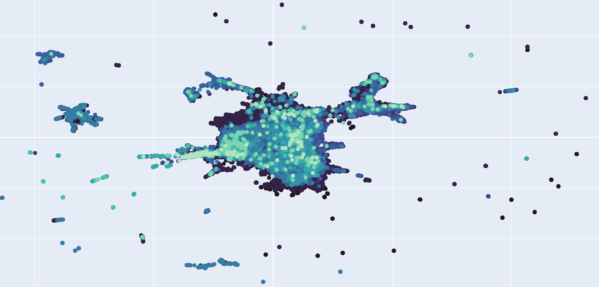
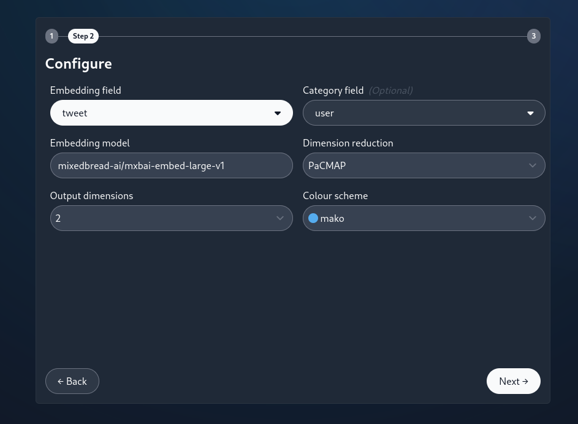

# Scatterbrain

Scatterbrain exposes common text-embedding use cases as a web application to faciliate no-code unstructured text proceesing.

Scatterbrain is a SvelteJS web application using Skeleton components served using python FastAPI, sentence transformers and plotly. Scatterbrain can read data from CSV, JSON and ndJSON input data and allows the user to configure target fields, models, sentence transformer prompts and more.

*Example semantic scatter plot created using Scatterbrain.*

*Example configuration options.*

# Functionality

Scatterbrain currently includes two functions:

- **semantic scatter:** Represent semantic relationships between inputs spatially, in either two or three dimensions as a scatter plot. Plots are produced with plotly and can be exported as fully self-contained HTML. Nodes may be optionally coloured using a category field. Useful for identifying patterns in very large unstructured data sets, such as communications or social media analysis. 

- **categorise:** Collapse diverse unstructured data into a closed list of categories using text embeddings and vector similarities. Useful for data classification tasks, such as such as collapsing free text location descriptions into country codes.

If you have a request, please get in touch or open an issue!

# Installation & usage

Scatterbrain is most easily run using docker. With docker installed, from this directory, run `docker image build -t scatterbrain .` to build and then `docker run -p 8000:8000 scatterbrain` to serve the application. Access the application with a web browser on `http://localhost:8000`. A prebuilt docker image is also available from the docker hub and can be run with `docker run -p 8000:8000 0jsec/scatterbrain:latest`.

You can alternatively compile the application and serve it directly. Create the Svelte static web application files by running `npm install` and `npm run build` in the `./client` directory (requires npm). Run the fastAPI server by running `pip install -r requirements.txt` and `python3 server.py` in the `./server` directory (requires python3.10+ and pip).

Note that text embedding operations are memory and processor intensive. The web application gives feedback about processing progress to enable time assessment but you should also ensure you have enough memory to comfortably hold your chosen embedding model, your dataset and more than 2kb per vector created, with some room left over for the web application and dimension reduction model.  

